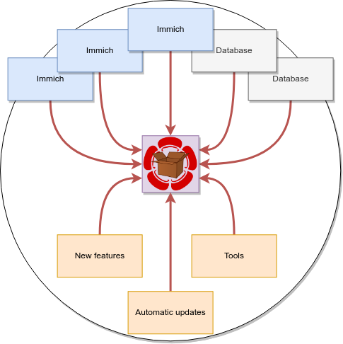

# Immich Distribution

> First an important mention, this is **NOT** an official package of [Immich](https://immich.app/). If you like to have Immich installed directly from the Immich project use the official [Docker images](https://immich.app/docs/install/docker-compose). Do not report bugs to upstream _unless_ you are sure that the same bug is present in the upstream images. Feel free to ask **me** if you are unsure.

<p align="center">
  
</p>

## About

In short, this is an [Immich](https://immich.app/) Distribution packaged inside a [snap](https://snapcraft.io/docs) package. The package is inspired of the official Immich images. It will be similar, but not identical with the official Docker-based installation. It will ship the same software, but with limited customability. Extra tools are included, they should be non-intrusive and you can ignore them if you like.

For more information see the project page at https://immich-distribution.nsg.cc/

## Installation
[](https://snapcraft.io/immich-distribution)

```
sudo snap install immich-distribution
```

For detailed installation instructions with recommendations and hardware requirements, automatic updates and configuration see the [installation documentation](https://immich-distribution.nsg.cc/install/) pages at the projects website. 

## Documentation

See the documentation site at https://immich-distribution.nsg.cc/ for more information.

## Included software

| Software | Note |
| -------- | -------- |
| Immich Server | This is the server component of Immich that provides Immich API |
| Immich Machine Learning | Object detection and image classifier, provides and API for Immich |
| Immich Web | The Immich web pages |
| Immich Distribution Sync | Synchronize (read & write) a external folder (with a few caveats) with Immich |
| Immich Distribution Backup | Tool for easy backup and restore of Immich |
| [Postgres](https://www.postgresql.org/) | Relational database used by Immich |
| [Redis](https://redis.io/) | Fast key-value database used by Immich |
| [HAProxy](https://www.haproxy.org/) | Service that proxies traffic to Immich web and server |
| [uacme](https://github.com/ndilieto/uacme) | A Let's Encrypt ACME client used to checkout TLS certificates |

## License

All files in this repository are released under the MIT license. Upstream Immich is also licensed under the [MIT](https://github.com/immich-app/immich/blob/main/LICENSE) license.
