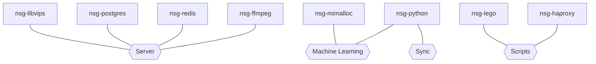

# Package dependencies

I use this page to track custom built deb-packages that I have built as a dependency for Immich Distribution. The packages are build in clean containers targeting Ubuntu 22.04.

## Repository

```
deb [arch=amd64 signed-by=/etc/apt/keyrings/nsg.gpg] http://apt.nsg.cc jammy main
```

You find the key at `snap/keys/`, you need to dearmor it with `cat 8FA0B5E3.asc | gpg --dearmor -o /etc/apt/keyrings/nsg.gpg`

## Package dependency

### libvips


Immich uses sharp for image processing. Sharp uses libvips, and libvips has imagemagick as a backend and uses it as a fallback engine if it can't handle an image format directly.

### Immich


