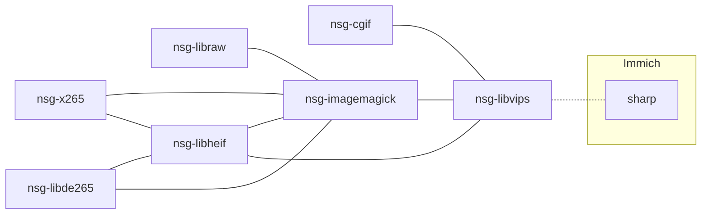
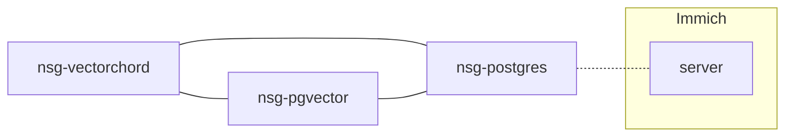
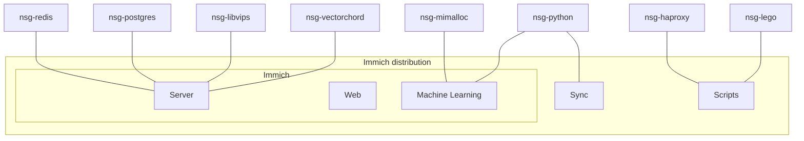

# Package dependencies

I use this page to track custom built deb-packages that I have built as a dependency for Immich Distribution. The packages are build in clean containers targeting Ubuntu 22.04.

## Repository

```
deb [signed-by=/etc/apt/trusted.gpg.d/nsg.gpg] https://nsg.github.io/aptly/deb ./
```

You can import the GPG key with: `curl -Ls https://nsg.github.io/aptly/nsg.gpg | gpg --dearmor -o /etc/apt/trusted.gpg.d/nsg.gpg`

For more information and available packages, visit: [https://nsg.github.io/aptly/](https://nsg.github.io/aptly/).

## Package dependency

### libvips



Immich uses sharp for image processing. Sharp uses libvips, and libvips has imagemagick as a backend and uses it as a fallback engine if it can't handle an image format directly.

### VectorChord



### Immich Distribution


