+++
title = "Statistics"
+++

# Statistics

I have automatized a lot of the upgrade process. Issues will be created, with links to Immich release notes. I also generate diffs of files that I track changes in. A PR is automatically created with bumped versions ready to be pulled, or merged. Some of the updates has been a pain to figure out with several weeks of trouble shooting, and some where literally a single click. Thankfully most has been closer to the later, easy, kind.

Overall I try to merge a new release within a few days, but depending on the complexity, or how busy I am, the actual time will vary. I made a graph below displaying the time from Immich release until the new release was merged and released to the edge channel. I typically release to stable 1-2 days later.

```mermaid
gantt
    title Immich Distribution Releases
    dateFormat YYYY-MM-DD
    section R
        Immich 1.51.0     :2023-03-20, 2023-03-25
        Immich 1.51.1     :2023-03-21, 2023-03-25
        Immich 1.51.0     :2023-03-22, 2023-03-25
        Immich 1.52.0     :2023-03-29, 2023-04-01
        Immich 1.52.1     :2023-03-29, 2023-04-01
        Immich 1.53.0     :2023-04-06, 2023-04-06
        Immich 1.54.0     :2023-04-18, 2023-04-25
        Immich 1.54.1     :2023-04-23, 2023-04-25
        Immich 1.55.0     :2023-05-09, 2023-05-09
        Immich 1.55.1     :2023-05-09, 2023-05-09
        Immich 1.56.0     :2023-05-18, 2023-05-23
        Immich 1.56.1     :2023-05-19, 2023-05-23
        Immich 1.56.2     :2023-05-20, 2023-05-23
        Immich 1.57.0     :2023-05-23, 2023-05-23
        Immich 1.57.1     :2023-05-23, 2023-05-23
        Immich 1.58.0     :2023-05-28, 2023-06-08
        Immich 1.59.0     :2023-05-30, 2023-06-08
        Immich 1.59.1     :2023-05-30, 2023-06-08
        Immich 1.60.0     :2023-06-04, 2023-06-08
        Immich 1.61.0     :2023-06-16, 2023-06-22
        Immich 1.62.0     :2023-06-19, 2023-06-24
        Immich 1.62.1     :2023-06-20, 2023-06-24
        Immich 1.63.0     :2023-06-24, 2023-06-26
        Immich 1.63.2     :2023-06-25, 2023-06-26
        Immich 1.64.0     :2023-06-26, 2023-06-27
        Immich 1.65.0     :2023-06-30, 2023-07-01
        Immich 1.66.0     :2023-07-04, 2023-07-09
        Immich 1.66.1     :2023-07-05, 2023-07-09
        Immich 1.67.0     :2023-07-14, 2023-07-17
        Immich 1.67.1     :2023-07-14, 2023-07-17
        Immich 1.67.2     :2023-07-14, 2023-07-17
        Immich 1.68.0     :2023-07-20, 2023-07-26
        Immich 1.69.0     :2023-07-23, 2023-07-27
        Immich 1.70.0     :2023-07-27, 2023-07-27
        Immich 1.71.0     :2023-07-29, 2023-07-30
        Immich 1.72.0     :2023-08-06, 2023-08-13
        Immich 1.72.1     :2023-08-07, 2023-08-13
        Immich 1.72.2     :2023-08-07, 2023-08-13
        Immich 1.73.0     :2023-08-15, 2023-08-16
        Immich 1.74.0     :2023-08-19, 2023-08-19
        Immich 1.75.0     :2023-08-26, 2023-08-31
        Immich 1.75.1     :2023-08-26, 2023-08-31
        Immich 1.75.2     :2023-08-27, 2023-08-31
        Immich 1.76.0     :2023-08-29, 2023-08-31
        Immich 1.76.1     :2023-08-30, 2023-08-31
        Immich 1.77.0     :2023-09-06, 2023-09-12
        Immich 1.78.0     :2023-09-13, 2023-09-15
        Immich 1.78.1     :2023-09-14, 2023-09-15
        Immich 1.79.0     :2023-09-21, 2023-09-24
        Immich 1.79.1     :2023-09-22, 2023-09-24
        Immich 1.80.0     :2023-10-02, 2023-10-04
        Immich 1.81.0     :2023-10-03, 2023-10-06
        Immich 1.81.1     :2023-10-04, 2023-10-06
        Immich 1.82.0     :2023-10-17, 2023-10-19
        Immich 1.82.1     :2023-10-18, 2023-10-19
        Immich 1.83.0     :2023-10-28, 2023-11-03
        Immich 1.84.0     :2023-11-01, 2023-11-04
        Immich 1.85.0     :2023-11-08, 2023-11-08
        Immich 1.86.0     :2023-11-14, 2023-11-15
        Immich 1.87.0     :2023-11-18, 2023-11-21
        Immich 1.88.0     :2023-11-20, 2023-11-26
        Immich 1.88.1     :2023-11-21, 2023-11-26
        Immich 1.88.2     :2023-11-21, 2023-11-26
        Immich 1.89.0     :2023-11-29, 2024-01-03
        Immich 1.90.0     :2023-12-07, 2024-01-05
        Immich 1.90.1     :2023-12-08, 2024-01-05
        Immich 1.90.2     :2023-12-08, 2024-01-05
        Immich 1.91.0     :2023-12-15, 2024-01-13
        Immich 1.91.1     :2023-12-16, 2024-01-13
        Immich 1.91.2     :2023-12-17, 2024-01-13
        Immich 1.91.3     :2023-12-17, 2024-01-13
        Immich 1.91.4     :2023-12-19, 2024-01-13
        Immich 1.92.0     :2024-01-08, 2024-01-13
        Immich 1.92.1     :2024-01-08, 2024-01-13
        Immich 1.93.0     :2024-01-19, 2024-02-04
        Immich 1.93.1     :2024-01-19, 2024-02-04
        Immich 1.93.2     :2024-01-19, 2024-02-04
        Immich 1.93.3     :2024-01-20, 2024-02-04
        Immich 1.94.0     :2024-01-31, 2024-02-04
        Immich 1.94.1     :2024-01-31, 2024-02-04
        Immich 1.95.0     :2024-02-20, 2024-02-24
        Immich 1.95.1     :2024-02-21, 2024-02-24
        Immich 1.96.0     :2024-02-27, 2024-03-10
        Immich 1.97.0     :2024-02-28, 2024-03-11
        Immich 1.98.0     :2024-03-07, 2024-03-12
        Immich 1.98.1     :2024-03-09, 2024-03-12
        Immich 1.98.0     :2024-03-11, 2024-03-12
```

Wow, that's **a lot of releases**! I feel that I have been able to release most releases in a reasonable time, except that period in November where I got stuck troubleshooting the sharp library to enable HEIC support.
